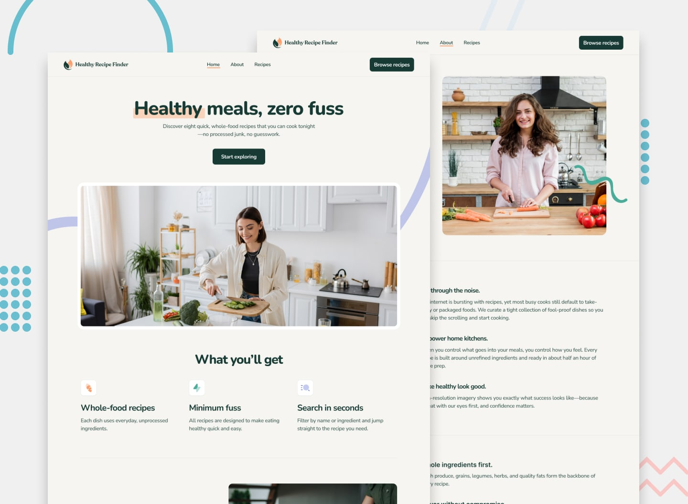

# Recipe finder website

## Welcome! 👋
This challenge is from FrontEnd Mentor and use strong understanding of HTML, CSS, JavaScript and React.js.

## The challenge

Users should be able to:

- View the home, about, recipes index, and recipe detail pages
- Search for recipes by name or ingredient
- Filter recipes by max prep or cook time
- View the optimal layout for the interface depending on their device's screen size
- See hover and focus states for all interactive elements on the page

**Have fun!** 🚀
